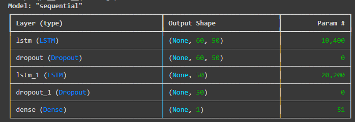
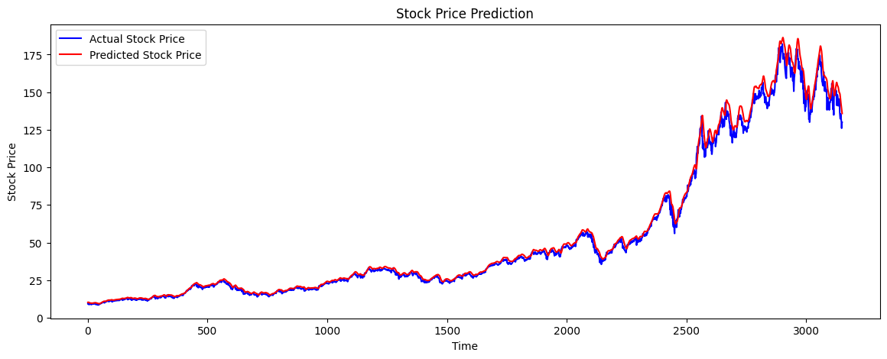

# Stock Price Prediction Using LSTM

This project demonstrates how to use Long Short-Term Memory (LSTM) networks to predict future stock prices based on historical data. The project is designed to help you learn about LSTM and its application in time series forecasting.

## Data Collection

We obtain historical stock price data using the `yfinance` library to fetch it directly for a company like Apple (AAPL).

```python
import yfinance as yf

df = yf.download('AAPL', start='2010-01-01', end='2023-01-01')
df.head()
```

## Data Preprocessing

### Feature Selection
For simplicity, we use the 'Close' price as the feature to predict.

### Normalization
We scale the data using `MinMaxScaler` to normalize the prices between 0 and 1. Then, we split the data into training and testing sets (80% training, 20% testing).

### Create Sequences
LSTMs require input to be in the form of sequences, so we use the last 60 days to predict the next day's price.

```python
import numpy as np
from sklearn.preprocessing import MinMaxScaler

scaler = MinMaxScaler(feature_range=(0, 1))
df_scaled = scaler.fit_transform(df['Close'].values.reshape(-1, 1))

sequence_length = 60
X_train, y_train = [], []

for i in range(sequence_length, len(df_scaled)):
    X_train.append(df_scaled[i-sequence_length:i, 0])
    y_train.append(df_scaled[i, 0])

X_train, y_train = np.array(X_train), np.array(y_train)

# Reshape for LSTM (samples, time steps, features)
X_train = np.reshape(X_train, (X_train.shape[0], X_train.shape[1], 1))
print(X_train.shape)
```

## The LSTM Model

We define an LSTM model with the following layers:
- An LSTM layer with 50 units
- A Dense layer with 1 unit (output)
- Adam optimizer and Mean Squared Error as the loss function

```python
from tensorflow.keras.models import Sequential
from tensorflow.keras.layers import LSTM, Dense, Dropout

model = Sequential()
model.add(LSTM(units=50, return_sequences=True, input_shape=(X_train.shape[1], 1)))
model.add(Dropout(0.2))
model.add(LSTM(units=50, return_sequences=False))
model.add(Dropout(0.2))
model.add(Dense(units=1))  # Predict the next closing price

model.compile(optimizer='adam', loss='mean_squared_error')
model.summary()
```



## Train Model

We train the model using the training data.

```python
model.fit(X_train, y_train, epochs=20, batch_size=32, validation_split=0.2)
```

## Model Evaluation

We prepare the test dataset and evaluate the model's performance.

```python
# Prepare the test dataset
test_data = df['Close'][-len(y_train):].values
test_data = scaler.transform(test_data.reshape(-1, 1))

X_test = []
for i in range(sequence_length, len(test_data)):
    X_test.append(test_data[i-sequence_length:i, 0])

X_test = np.array(X_test)
X_test = np.reshape(X_test, (X_test.shape[0], X_test.shape[1], 1))

# Predicting
predictions = model.predict(X_test)
predictions = scaler.inverse_transform(predictions)
```

## Visualizing the Results

Finally, we visualize the actual vs. predicted stock prices.

```python
import matplotlib.pyplot as plt

plt.figure(figsize=(14,5))
plt.plot(df['Close'][-len(predictions):].values, color='blue', label='Actual Stock Price')
plt.plot(predictions, color='red', label='Predicted Stock Price')
plt.title('Stock Price Prediction')
plt.xlabel('Time')
plt.ylabel('Stock Price')
plt.legend()
plt.show()
```

