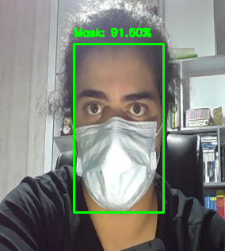

# Jupyter Notebooks Collection

This repository contains my data science, machine learning, and algorithmic projects. Below is an overview of each project included in this repository.

---

### 1. Eigenfaces for Face Recognition
The Eigenfaces method is used for face recognition by reducing the dimensionality of face images using Principal Component Analysis (PCA). This method identifies the components with the most information and captures the most variance. Each face is represented by a combination of eigenfaces, and recognition is performed by comparing the distances between these eigenfaces.

[Read more](eigenfaces/README.md)

---

### 2. Clustering and Topic Modeling of COVID-19 Research Articles
This project clusters COVID-19 research articles and extracts key topics from them using **TF-IDF** vectorization, **PCA**, and **LDA** topic modeling. Various clustering techniques such as KMeans and DBSCAN are applied, and visualizations are provided.

[Read more](covid19-NLP/README.md)

---

### 3. Weather Data Analysis
This project focuses on analyzing historical weather data using machine learning algorithms to predict rainfall the following day. The analysis involves handling missing values, encoding categorical data, and applying multiple classification models like Decision Tree, K-Nearest Neighbors (KNN), and Support Vector Machine (SVM). 

[Read more](weather_analyze/README.md)

---

### 4. LSTM Stock Price Prediction
This project implements a **Long Short-Term Memory (LSTM)** neural network to predict stock prices based on historical data. The notebook demonstrates data preprocessing, model training, and evaluation of the prediction results.

[Read more](LSTM-stock-prediction/README.md)

---

### 5. Monopoly Simulation
This project implements a simplified version of the Monopoly board game using the **Expectiminimax** algorithm for decision-making

The project features core Monopoly mechanics such as property buying, rent collection, and monopolies, and applies the Expectiminimax algorithm to compute the best actions for AI players based on game states and the uncertainty introduced by dice rolls.

[Read more](monopoly/README.md)

---

### 6. N-Queen Problem Using Genetic Algorithm
This notebook solves the **N-Queen problem** using a genetic algorithm, which finds an arrangement of queens on a chessboard such that no two queens attack each other.

[Read more](nqueen-genetic/README.md)

---

### 7. Sudoku Solver Using CSP
This project implements a **Sudoku solver** using a **Constraint Satisfaction Problem (CSP)** approach, where constraints are applied to efficiently solve Sudoku puzzles.

.png)

[Read more](sudoku_CSP/README.md)

---

### 8. Face Mask Detection
This project uses **convolutional neural networks (CNN)** to detect whether a person is wearing a face mask. The model is trained using a dataset of images with and without masks.

[Read more](face-mask-detection/README.md)

---

### 9. Federated Learning with Fashion MNIST
This notebook explores **Federated Learning** by training a model on the **Fashion MNIST** dataset across distributed clients, simulating decentralized data training.

[Read more](FL-MNIST/README.md)

---

### 10. Linear SAT Solver
This notebook solves **Satisfiability Problems (SAT)** using linear algebraic methods, providing an efficient approach to solving large instances of SAT problems.

[Read more](linear-SAT-solver/README.md)

---

### 11. Ford-Fulkerson Algorithm with Minimum Cut Visualization
This project implements the **Ford-Fulkerson algorithm** to find the maximum flow in a flow network, followed by visualizing the **minimum cut**.

[Read more](ford_fulkerson_algorithm/README.md)

---

### 12. Lambda NFA to DFA Converter
This notebook demonstrates converting a **lambda Nondeterministic Finite Automaton (NFA)** to a **Deterministic Finite Automaton (DFA)** and checks if a given input string is accepted by the automaton. 

[Read more](lambda_nfa_to_dfa/README.md)

---

### 13. Matrix Multiplication Performance Analysis
This project compares the performance of matrix multiplication using **numpy**, **single-threaded**, and **multi-threaded** implementations in Python, with a C++ implementation for benchmarking. The primary goal is to analyze the efficiency of these methods.

[Read more](mutex-acquire/README.md)

---

Each project is documented with instructions on setup, execution, and the key concepts involved. Feel free to explore the individual notebooks linked above for detailed explanations and implementations.
