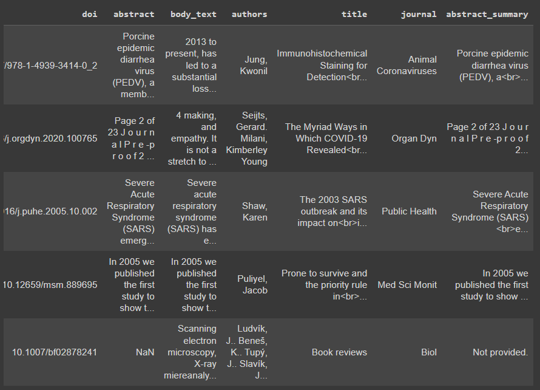
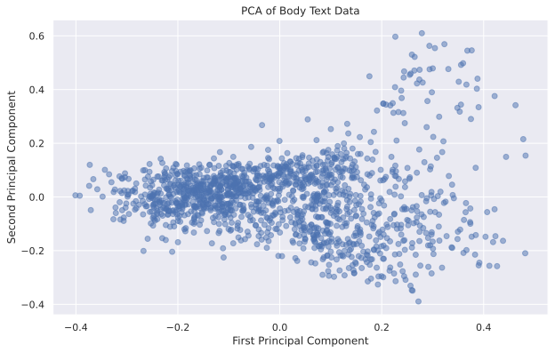
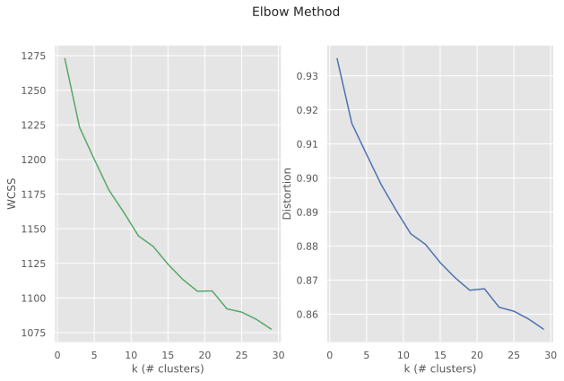
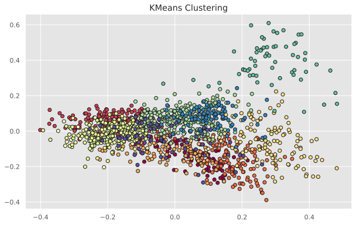
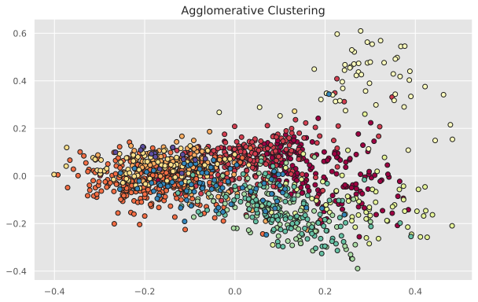
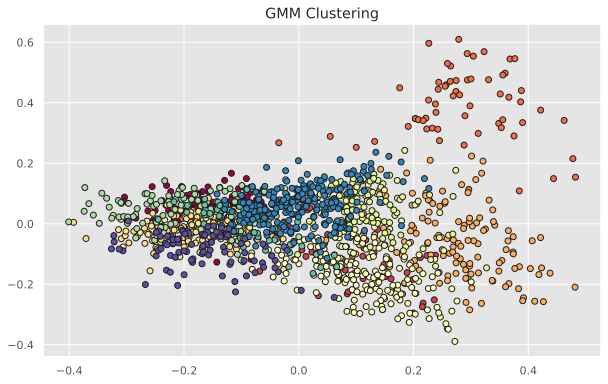
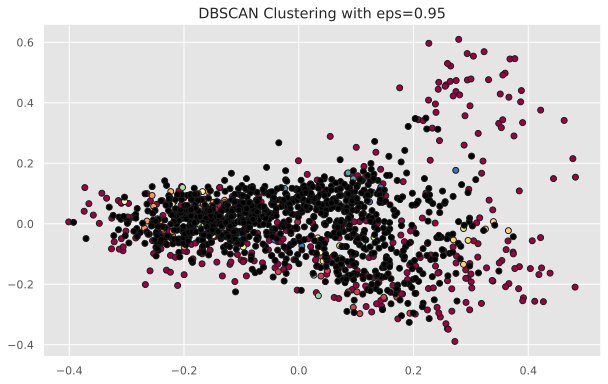
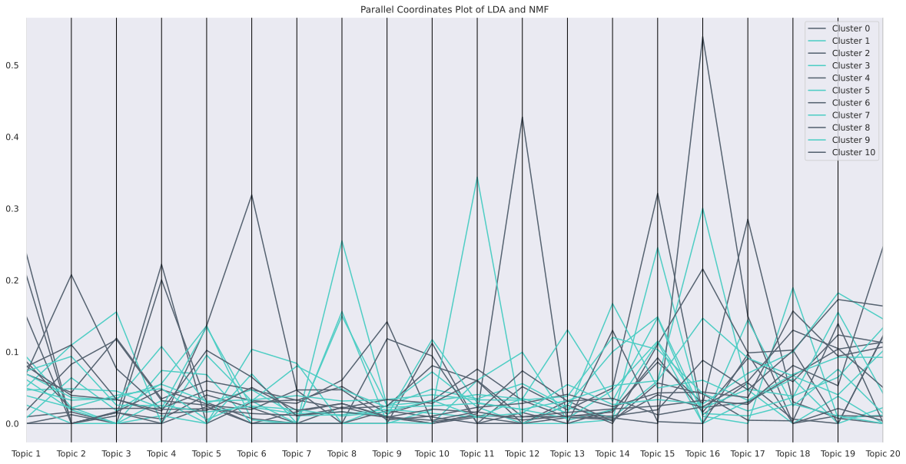
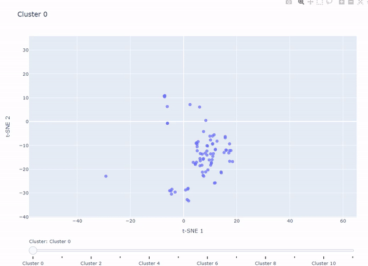

# Clustering and Topic Modeling of COVID-19 Research Articles

## Table of Contents

- [Project Overview](#project-overview)
- [Setup](#setup)
- [Data Preprocessing](#data-preprocessing)
- [Feature Extraction](#feature-extraction)
- [Dimensionality Reduction](#dimensionality-reduction)
- [Clustering](#clustering)
- [t-SNE](#t-sne)
- [Topic Modeling](#topic-modeling)
- [Interactive Plot](#interactive-plot)
- [Contributors](#contributors)
- [Collaboration](#collaboration)

## Project Overview

This project focuses on clustering COVID-19 research papers and extracting key topics from them. Over the past few years, with the outbreak of COVID-19, a significant number of research papers have been published. Specialists in scientific and computational communities face the challenge of quickly finding the information they need from the vast amount of articles. This dataset comprises articles and research related to COVID-19. The goal is to facilitate the review of many related publications and assist specialists in making informed decisions.

[Google Colab Notebook](https://colab.research.google.com/github/Ali-Noghabi/covid19-NLP/blob/main/Covid19_NLP.ipynb)
## Setup

### Load and Import Libraries

Before running the notebook, ensure you have all the required libraries installed. Use the following commands to install the necessary packages:

```bash
pip install langdetect kneed scispacy
pip install https://s3-us-west-2.amazonaws.com/ai2-s2-scispacy/releases/v0.5.4/en_core_sci_lg-0.5.4.tar.gz
```

Import the necessary libraries:

```python
import numpy as np
import pandas as pd
import matplotlib.pyplot as plt
import seaborn as sns
from tqdm import tqdm
from langdetect import detect, DetectorFactory
import spacy
import en_core_sci_lg
import string
from sklearn.feature_extraction.text import TfidfVectorizer, CountVectorizer
from sklearn.decomposition import PCA, LatentDirichletAllocation, NMF
from sklearn.manifold import TSNE
from sklearn.cluster import KMeans, AgglomerativeClustering, DBSCAN
from sklearn.mixture import GaussianMixture
from kneed import KneeLocator
from sklearn import metrics
from scipy.spatial.distance import cdist
from sklearn.metrics import silhouette_score
from sklearn.preprocessing import StandardScaler
import plotly.express as px
import plotly.graph_objects as go
```

## Data Preprocessing

### Load Dataset

The dataset comprises information on 10,000 articles in a CSV file, including:
- `id_paper`: A hash generated from the PDF files of the articles.
- `doi`: Digital Object Identifier for referencing articles.
- `abstract`: Abstract of the article (if available).
- `text_body`: Main text of the article.
- `authors`: Authors of the article, as a list of strings.
- `title`: Title of the article.
- `journal`: The journal in which the article was published.
- `summary_abstract`: Summary of the abstract.

Load the dataset and perform initial preprocessing:

**download csv files:**
- [10k dataframe](https://drive.google.com/uc?id=15E8FLX0C-6qpK-lDBEQJXw00Lsdcvjae)
- [pre processed](https://drive.google.com/uc?id=18Ju-NDzJZbdD0d_Zb-UFekYjVxBweMwE)
- [tfidf vectors](https://drive.google.com/uc?id=1V0VHdYwOPFMQhdyzYonPZYkqQsLhyjBd)
```python
df_10k = pd.read_csv('10k_df.csv')
df_10k.fillna(value=" ", inplace=True)
df = df_10k.sample(1500, random_state=42)
```



### Text Processing

- **Language Detection and Selection:**
  Detect the language of the text and filter for the desired language.
  
- **Tokenization, Lemmatization, and Stemming:**
  Process the text by tokenizing, lemmatizing, and stemming.

- **Stopword and Punctuation Removal:**
  Remove stopwords and punctuation from the text.

```python
def detect_language(text):
    try:
        return detect(text)
    except:
        return "unknown language."

df = df[df['body_text'].apply(detect_language) == 'en']

stemmer = PorterStemmer()
parser = en_core_sci_lg.load(disable=["tagger", "ner"])
parser.max_length = 3000000

def process_text(text):
    doc = parser(text)
    tokens = [token for token in doc if not token.is_stop and token.text not in string.punctuation]
    return [stemmer.stem(token.text) for token in tokens]

df['body_text'] = df['body_text'].apply(lambda text: process_text(text))
```

## Feature Extraction

Extract features from the text using TF-IDF vectorization:

```python
tf_idf = TfidfVectorizer(max_features=4096)
tfidf_vectors = tf_idf.fit_transform([' '.join(tokens) for tokens in df['body_text']])
tfidf_df = pd.DataFrame(tfidf_vectors.toarray(), columns=tf_idf.get_feature_names_out())
```

## Dimensionality Reduction

Reduce the dimensionality of the TF-IDF vectors using PCA:

```python
pca = PCA(n_components=0.95, svd_solver='full')
body_text_df = pca.fit_transform(tfidf_df)
```

## Clustering

### Elbow Method

Determine the optimal number of clusters using the Elbow Method:

```python
def Elbow_Method(data, kmin=1, kmax=31):
    k_values = range(kmin, kmax, 2)
    wcss_values = []
    distortion_values = []

    for k in k_values:
        kmeans = KMeans(n_clusters=k, random_state=16, n_init="auto")
        kmeans.fit(data)
        distortion_values.append(np.sum(np.min(cdist(data, kmeans.cluster_centers_, 'euclidean'), axis=1)) / data.shape[0])
        wcss_values.append(kmeans.inertia_)

    return k_values, wcss_values, distortion_values

k, wcss, distortion = Elbow_Method(body_text_df)
```


### Clustering Methods

Apply various clustering methods and evaluate their performance using Silhouette Score:

- **KMeans:**
  ```python
  kmeans = KMeans(n_clusters=n_clusters, random_state=16, n_init="auto")
  kmeans.fit(body_text_df)
  labels_kmeans = kmeans.labels_
  ```
  

- **Agglomerative Clustering:**
  ```python
  agg_cluster = AgglomerativeClustering(n_clusters=n_clusters)
  labels_agg = agg_cluster.fit_predict(body_text_df)
  ```
  

- **Gaussian Mixture Models:**
  ```python
  gmm = GaussianMixture(n_components=n_clusters, random_state=42)
  labels_gmm = gmm.fit_predict(body_text_df)
  ```
  

- **DBSCAN:**
  ```python
  dbscan = DBSCAN(eps=0.5, min_samples=5)
  labels_dbscan = dbscan.fit_predict(body_text_df)
  ```
  

## t-SNE
Visualize the clusters using t-SNE:

```python
body_text_2D = TSNE(n_components=2, perplexity=30).fit_transform(body_text_df)

sns.scatterplot(x=body_text_2D[:, 0], y=body_text_2D[:, 1])
plt.title('t-SNE with no Labels')
plt.show()
```


## Topic Modeling

### Apply LDA and NMF

Perform topic modeling using LDA and NMF for each cluster:

```python
lda_models = []
nmf_models = []

for i in range(n_clusters):
    if vectorized_data[i] is not None:
        lda = LatentDirichletAllocation(n_components=NUM_TOPICS_PER_CLUSTER, max_iter=10, learning_method='online', verbose=False, random_state=42)
        lda_model = lda.fit(vectorized_data[i])
        lda_models.append(lda_model)
        
        nmf = NMF(n_components=NUM_TOPICS_PER_CLUSTER, max_iter=2000, tol=1e-3, init='nndsvda', random_state=42)
        nmf_model = nmf.fit(vectorized_data[i])
        nmf_models.append(nmf_model)
    else:
        lda_models.append(None)
        nmf_models.append(None)
```


## Interactive Plot

Create an interactive plot to visualize the clusters:



## Contributors

- **Shervin Ghaffari**: shervinghaffari79@gmail.com
- **Sarah Khamseh**: khamsehsarah@gmail.com
- **Ali Noghabi**: a.noghabi2002@gmail.com

## Collaboration

We welcome contributions to this project. Feel free to collaborate by reaching out to any of the contributors listed above.
