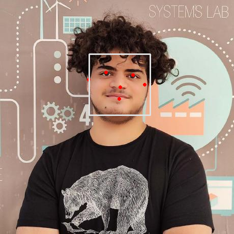

# Face Detection using MediaPipe
This repository contains code for detecting faces in images using MediaPipe library. The code utilizes the face detection model provided by MediaPipe to detect faces in images.<br>
[colab notebook](https://colab.research.google.com/github/Ali-Noghabi/face-detection/blob/main/face_detection.ipynb)

## Dependencies
- Python 3.x
- OpenCV
- MediaPipe

## Installation

You can install the required dependencies using pip:

```bash
pip install opencv-python mediapipe
```

## Usage

1. Clone the repository
2. Ensure to change the path to the image you want to process by modifying the following line in the script:
```python
IMAGE_FILES = ["/path/to/your/image.jpg"]
```

3. Run the script with your desired image:

```bash
python face_detection.py
```

## Result


