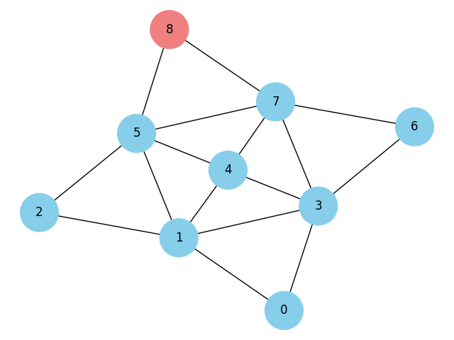

# Ford-Fulkerson Algorithm with Minimum Cut Visualization

**Link to the notebook:** [Ford-Fulkerson and Minimum Cut Jupyter Notebook](https://colab.research.google.com/gist/Ali-Noghabi/aacd1614c5080bd12d35a7f22710872f/ford_fulkerson_algorithm.ipynb)

## Project Overview

This project implements the Ford-Fulkerson algorithm for finding the **maximum flow** in a flow network and the **minimum cut** that separates a source from a sink. The algorithm is visualized on an example graph with iterative steps showing the progression of maximum flow, and a final minimum cut result. 

## Algorithm Overview

### Ford-Fulkerson Algorithm

The **Ford-Fulkerson algorithm** calculates the maximum flow in a flow network using the concept of augmenting paths. It repeatedly finds a path from the source to the sink with available capacity and sends flow along that path. The algorithm is greedy in nature and operates until no more augmenting paths can be found.

The process involves:
1. **Residual Graph**: Constructing a residual graph to keep track of the remaining capacity in the network.
2. **BFS or DFS for Augmenting Path**: Finding a path from the source to the sink that has remaining capacity.
3. **Flow Augmentation**: Increasing the flow along that path by the minimum capacity found on the path.
4. **Repeat** until no more augmenting paths can be found.

### Minimum Cut

Once the maximum flow is found, the residual graph can be used to compute the **minimum cut**. The minimum cut is the smallest set of edges that, when removed, separates the source from the sink. The minimum cut in a flow network is closely related to the maximum flow, as the maximum flow through the network is equal to the capacity of the minimum cut.

The **minimum cut** can be found using the residual graph:
- **Reachable set**: Nodes that can still be reached from the source in the residual graph.
- **Non-reachable set**: Nodes that cannot be reached from the source in the residual graph. The edges between these two sets form the minimum cut.

## Example Graph

The example graph used in this project contains 9 nodes (0 through 8) and edges with capacities as shown in the diagrams below.

The algorithm starts by finding the maximum flow from the source node (0) to the sink node (8) using the Ford-Fulkerson method. After the maximum flow is achieved, the minimum cut is visualized.

### Minimum Cut Visualization

Once the maximum flow is reached, the minimum cut is computed. The minimum cut separates the source (0) from the sink (8), identifying the smallest set of edges that, when removed, would stop all flow between these two nodes.

- **Minimum Cut**: Edges between the reachable and non-reachable nodes are highlighted, showing the minimum cut.

