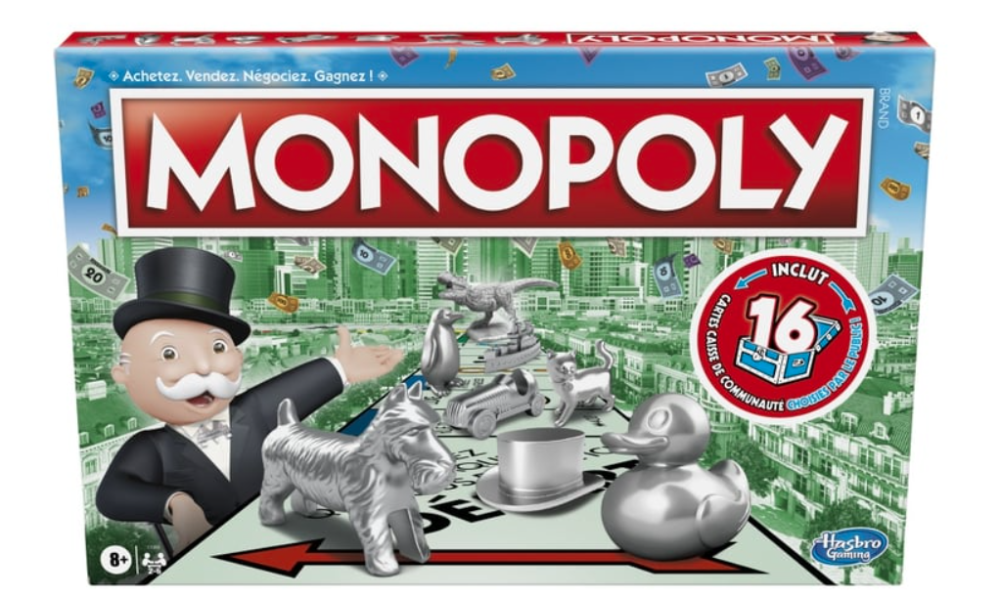

# Monopoly with Expectiminimax

## Project Overview
This project implements a simplified version of the Monopoly board game using the **Expectiminimax** algorithm for decision-making. The goal is to simulate AI gameplay by predicting potential outcomes based on different states of the game, using probabilistic reasoning to evaluate moves. 

The project features core Monopoly mechanics such as property buying, rent collection, and monopolies, and applies the Expectiminimax algorithm to compute the best actions for AI players based on game states and the uncertainty introduced by dice rolls.


## What is Expectiminimax?
**Expectiminimax** is an algorithm used in decision-making where outcomes are uncertain. It is an extension of the Minimax algorithm and is commonly used in games with randomness (e.g., dice rolls in Monopoly). The algorithm combines:

- **Max nodes** (for maximizing player gains),
- **Min nodes** (for minimizing opponent gains), and
- **Chance nodes** (for probabilistic events such as rolling a dice).

The AI attempts to select the best move by exploring future game states, assuming rational behavior from all players and incorporating randomness.

### How Expectiminimax Works:
1. **Max nodes**: AI maximizes its expected rewards (similar to traditional minimax).
2. **Min nodes**: Assumes opponents minimize the AI’s rewards.
3. **Chance nodes**: Handle random events like dice rolls by averaging over all possible outcomes.

## Monopoly Implementation
In this project, Monopoly's mechanics are abstracted into a few key components:
- **Properties and Rent**: Players can buy properties, and other players must pay rent when they land on owned properties. Monopolies (ownership of all properties in a group) increase the rent for those properties.
- **Player Actions**: Each player (including the AI) can decide whether to buy, trade, or upgrade properties based on the current state of the board and their finances.
- **Game Board**: The Monopoly board is represented as a list of cells, each of which can be a property, utility, or special cell (such as "Go to Jail").
- **AI Decisions**: The AI uses Expectiminimax to decide the best move at each turn, considering the roll of the dice and all possible outcomes of its actions.

## Reward Function
The **get_reward** function evaluates the state of the game and assigns a numerical value to it, representing the utility of that state for the AI player. The reward calculation is inspired by concepts from the paper titled "[Decision Making in Monopoly using a Hybrid Deep Reinforcement Learning Approach](https://arxiv.org/abs/2103.00683)" where the reward is based on:

- **Cash and Properties**: Players with higher cash balances and more valuable properties have a higher reward.
- **Monopolies**: Owning a complete property group (a monopoly) significantly increases the reward because of the higher rents collected.
- **Imminent Threats**: Players facing high potential costs (e.g., landing on expensive properties) receive lower rewards.
- **Game End Conditions**: The reward is also adjusted based on whether the game is close to ending, with larger penalties for bankrupt players.

### Example of Reward Function:
```python
def get_reward(state):
    player = state["currentPlayer"]
    reward = player.cash

    # Add property value
    for prop in player.properties:
        reward += prop.mortgage_value
        if prop.isMonopoly:
            reward += prop.mortgage_value * 2  # Monopoly bonus

    # Subtract rent costs the player might face
    for opponent in state["opponents"]:
        for prop in opponent.properties:
            reward -= prop.rent

    return reward
```

### Sample Game Results
1. **Turn 1:**
   - **Human rolls 6**: Moves to *Oriental Avenue*, buys the property for $100.
   - **AI rolls 1**: No significant action.

2. **Turn 5:**
   - **Human rolls 5**: Moves to *Virginia Avenue*, buys it for $160.

3. **Turn 8:**
   - **Human rolls 6**: Lands on *Free Parking*, no action needed.

4. **Turn 12:**
   - **Human rolls 3**: Lands on *Ventnor Avenue*, buys the property for $260.

5. **Turn 20:**
   - **Human rolls 1**: Lands on *North Carolina Avenue*, buys it for $300.

6. **Turn 30:**
   - **Human rolls 3**: Lands on *Luxury Tax*, pays $75.

7. **Turn 35:**
   - **Human rolls 2**: Moves to *Mediterranean Avenue*, buys it for $60.

8. **Turn 45:**
   - **Human rolls 1**: Lands on *Short Line*, upgrades the property.

9. **Turn 55:**
   - **Human rolls 6**: Lands on *Atlantic Avenue (AI)*, pays $22 in rent.

10. **Final Turn:**
    - **Human rolls 3**: Lands on *Pennsylvania Avenue*, doesn’t have enough money, resulting in **AI’s bankruptcy**.

In this game, the Human player manages to build up a significant property portfolio early on and takes advantage of key opportunities, while the AI makes more conservative moves. After a series of successful property purchases and rent collections, the Human wins by bankrupting the AI.

## Contributors

- **Miriam**: [profile](https://github.com/maaaryam)
- **Ali Noghabi**: a.noghabi2002@gmail.com
