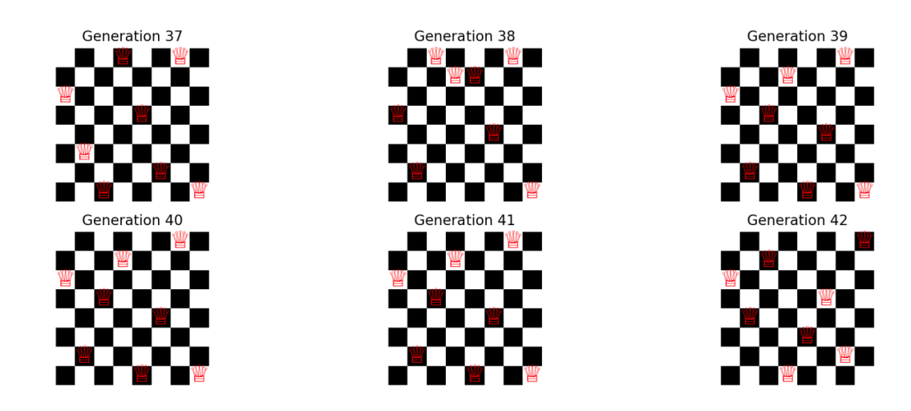

# **N-Queens Genetic Solver**

implementation of the N-Queens problem using a genetic algorithm. 

## **What is the N-Queens Problem?**

The N-Queens problem is a classic combinatorial puzzle in which the goal is to place N queens on an N×N chessboard so that no two queens attack each other. This means that no two queens can be placed in the same row, column, or diagonal. The challenge becomes increasingly difficult as N grows larger.

## **What is a Genetic Algorithm?**

A genetic algorithm (GA) is an optimization and search technique inspired by natural selection and genetics. Genetic algorithms evolve a population of potential solutions by mimicking the processes of biological evolution: selection, crossover, and mutation.

### **Key Steps of Genetic Algorithms**:
1. **Initialization**: A random population of potential solutions (called chromosomes) is generated.
2. **Fitness Evaluation**: Each solution is evaluated based on how well it solves the problem (fitness score).
3. **Selection**: Chromosomes with better fitness are selected to create new offspring.
4. **Crossover**: Selected chromosomes are combined to produce new solutions.
5. **Mutation**: Random changes are introduced to ensure diversity and prevent the algorithm from getting stuck in local optima.
6. **Termination**: The algorithm stops when a solution is found or after a certain number of generations.

## **Solving the N-Queens Problem with Genetic Algorithms**

### **Step-by-Step Approach**:
1. **Representation**: 
   - Each solution (chromosome) is represented as a list of integers where each index represents a column on the chessboard, and the value at each index represents the row position of the queen in that column. For example, `[0, 4, 7, 5, 2, 6, 1, 3]` is a potential solution for 8-Queens where queens are placed at coordinates (0,0), (1,4), (2,7), etc.
   
2. **Fitness Function**: 
   - The fitness function evaluates how well a chromosome solves the problem by counting the number of conflicts (horizontal and diagonal) between queens. A solution with no conflicts has the highest fitness score.

3. **Selection**: 
   - Solutions are selected probabilistically based on their fitness scores. Fitter solutions have a higher chance of being selected to reproduce.

4. **Crossover**: 
   - Selected parents exchange parts of their chromosomes at a random crossover point to produce new offspring.

5. **Mutation**: 
   - Mutation introduces random changes to individual chromosomes, helping the algorithm explore a broader solution space and avoid local optima.
   
6. **Termination**: 
   - The algorithm terminates when a valid solution (a board with no conflicts) is found, or the maximum number of generations is reached.

## **8-Queen Result**

The 8-Queens problem was solved using a genetic algorithm with the following parameters:

- **Population Size**: 100
- **Mutation Probability**: 0.1
- **Maximum Generations**: 500

### **Fitness Progression Over Generations**

The graph below shows the average fitness score of the population over the generations. Initially, the population had a low average fitness, indicating many conflicts between queens. As the generations progressed, the fitness increased, indicating fewer conflicts and a better overall population.

- **X-axis**: Generation number
- **Y-axis**: Average fitness score of the population
- **Observation**: The fitness score quickly increased in the first few generations, showing rapid improvement, and then slowly converged towards a solution.

### **First Generations**

In the first generation, queens are placed randomly, leading to multiple conflicts across rows, columns, and diagonals.

### **Last Generations**

In the last generation, the genetic algorithm successfully converged on a solution where all queens are placed such that they do not conflict, solving the 8-Queens problem.

