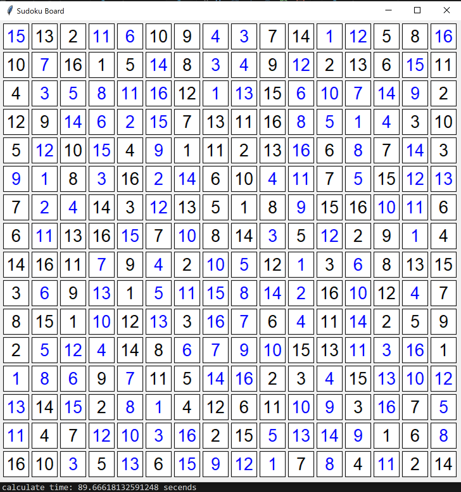

# Sudoku Solver Using CSP

## Project Overview
This project is a **Sudoku Solver** built using the principles of **Constraint Satisfaction Problem (CSP)**. It takes an unsolved Sudoku puzzle and applies the CSP algorithm to deduce the solution.

## About Sudoku
**Sudoku** is a popular logic-based number puzzle. The puzzle consists of a 9x9 grid, which is divided into 3x3 subgrids known as "regions" or "blocks". The objective is to fill the grid with digits from 1 to 9 following these rules:
- Each row must contain all digits from 1 to 9 without repetition.
- Each column must contain all digits from 1 to 9 without repetition.
- Each 3x3 subgrid must also contain all digits from 1 to 9 without repetition.

A Sudoku puzzle typically starts with some cells pre-filled with numbers, and the challenge is to fill the remaining cells while adhering to these rules.

.png)

## What is CSP (Constraint Satisfaction Problem)?
A **Constraint Satisfaction Problem (CSP)** is a type of problem in which the goal is to find a solution that satisfies a number of constraints or conditions. CSP consists of:
- **Variables**: These represent the unknowns or cells in Sudoku.
- **Domains**: The possible values that each variable can take. In Sudoku, each variable (cell) can take a number from 1 to 9.
- **Constraints**: Restrictions on the variables. For Sudoku, the constraints are that no number should repeat in any row, column, or 3x3 subgrid.


## Implementing the Sudoku Solver with CSP
The project is implemented in Python and uses the CSP framework to solve the Sudoku grid. Below is a brief explanation of the steps involved:

1. **Parsing the Puzzle**: 
   The input Sudoku grid is read from a file or entered manually. The grid is represented as a 2D array of integers, where `0` represents empty cells.

2. **Defining Variables and Domains**:
   Each empty cell in the grid is treated as a variable, and its domain is the set of possible numbers that can fill the cell, which is initially `{1, 2, 3, 4, 5, 6, 7, 8, 9}`.

3. **Setting Constraints**:
   The constraints are added to ensure that no row, column, or subgrid has duplicate numbers. These constraints guide the algorithm in selecting appropriate values for each cell.

4. **Applying CSP Algorithm**:
   The algorithm applies constraint propagation, where possible values are narrowed down by eliminating options that violate the Sudoku rules. Backtracking is employed when the algorithm reaches an unsolvable state for the current configuration, allowing it to try alternative solutions.

5. **Solving and Output**:
   Once all cells are filled following the constraints, the solution is printed or saved as output.

## Sample Results
### 9x9 Input Puzzle:
```
5 3 0 | 0 7 0 | 0 0 0
6 0 0 | 1 9 5 | 0 0 0
0 9 8 | 0 0 0 | 0 6 0
---------------------
8 0 0 | 0 6 0 | 0 0 3
4 0 0 | 8 0 3 | 0 0 1
7 0 0 | 0 2 0 | 0 0 6
---------------------
0 6 0 | 0 0 0 | 2 8 0
0 0 0 | 4 1 9 | 0 0 5
0 0 0 | 0 8 0 | 0 7 9
```

### Solved Puzzle:
.png)

### 16x16 Input Puzzle:
```
15  0   0  11  |  6   0   0   4  |  3   0   0   1  | 12   0   0  16
 0  7   0   0  |  0  14   0   3  |  4   0  12   0  |  0   0  15   0
 0  3   5   8  | 11  16   0   1  | 13   0   6  10  |  7  14   9   0
 0  0  14   6  |  2  15   0   0  |  0   0   8   5  |  1   4   0   0
--------------------------------------------------------------------
 0 12   0  15  |  0   9   0   0  |  0   0  16   0  |  8   0  14   0
 9  1   0   3  |  0   2  14   0  |  0   4  11   0  |  5   0  12  13
 0  2   4   0  |  0  12   0   0  |  0   0   9   0  |  0  10  11   0
 0 11   0   0  | 15   0  10   0  |  0   3   0  12  |  0   0   1   0
--------------------------------------------------------------------
 0   0   0   7  |  0   4   0  10  |  5   0   1   0  |  6   0   0   0
 0   6   0  13  |  0   5  11  15  |  8  14   2   0  | 10   0   4   0
 0   0   0  10  |  0  13   0  16  |  7   0   4   0  | 14   0   0   0
 0   5  12   4  |  0   0   6   7  |  9  10   0   0  | 11   3  16   0
--------------------------------------------------------------------
 1   8   6   0  |  7   0   0  14  | 16   0   0   4  |  0  13  10  12
13   0  15   0  |  8   1   0   0  |  0   0  10   9  |  0  16   0   5
11   0   0  12  | 10   3  16   0  |  0   5  13  14  |  9   0   0   8
 0   0   3   0  | 13   0  15   9  | 12   1   0   8  |  0  11   0   0
```

### Solved Puzzle:

