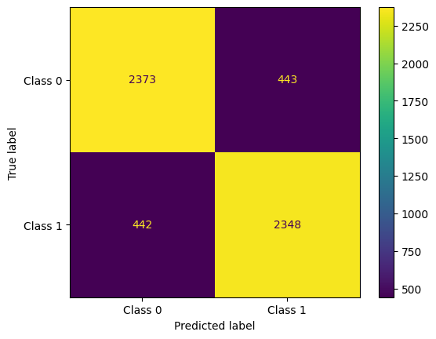
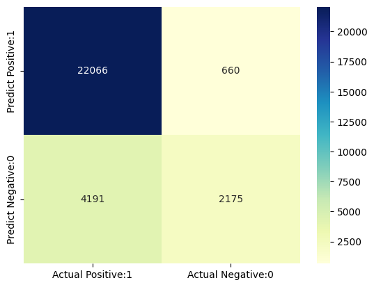

# Weather Data Analysis Project

## Project Description

This project focuses on analyzing historical weather data using machine learning algorithms to predict rainfall the following day. The analysis involves handling missing values, encoding categorical data, and applying multiple classification models like Decision Tree, K-Nearest Neighbors (KNN), and Support Vector Machine (SVM). The project also includes data visualization to better understand feature correlations and distributions.

## Dataset Description

The dataset contains daily weather observations collected from various locations across the country over the last ten years. It includes 145,460 samples and 22 features, which are a mix of numerical and categorical variables. Below is a brief description of the key features in the dataset:

- **Date**: The date of observation.
- **Weather Station**: Code representing the station where data was recorded.
- **Minimum/Maximum Temperature**: Minimum and maximum temperature recorded in Celsius.
- **Rainfall**: The amount of rainfall in millimeters on that day.
- **Evaporation**: The amount of evaporation recorded in millimeters on that day.
- **Sunshine**: The number of hours of sunshine recorded.
- **Gust Trajectory**: The direction of the strongest gust of wind recorded.
- **Air Velocity**: The wind speed in kilometers per hour.
- **Gust Trajectory at 9 AM/3 PM**: Wind direction 10 minutes prior to 9 AM and 3 PM.
- **Air Velocity at 9 AM/3 PM**: Wind speed at 9 AM and 3 PM.
- **Moisture Level at 9 AM/3 PM**: Humidity level in percentage at 9 AM and 3 PM.
- **Atmospheric Pressure at 9 AM/3 PM**: The pressure recorded in hectopascals at 9 AM and 3 PM.
- **Cloudiness at 9 AM/3 PM**: The extent of cloud cover, measured in eighths, at 9 AM and 3 PM.
- **Recorded Temperature at 9 AM/3 PM**: The temperature recorded in Celsius at 9 AM and 3 PM.
- **Rain that day**: A binary indicator of whether it rained on that day.
- **Rain the day after**: A binary indicator of whether it rained the next day (target variable).

## Methods Used

1. **Data Preprocessing**:
   - **Handling Missing Values**: Missing values were dealt with by interpolation, forward and backward filling, and in some cases, linear regression was applied to predict missing continuous values.
   - **Encoding Categorical Data**: Categorical variables such as wind direction and yes/no questions were encoded numerically. SMOTE (Synthetic Minority Over-sampling Technique) was used to handle imbalanced data.

2. **Decision Tree Classifier**:
   - The Decision Tree classifier was used to model the data and predict whether it will rain the next day. The model was evaluated using accuracy, precision, recall, F1 score, and a confusion matrix to assess performance.

    
3. **K-Nearest Neighbors (KNN)**:
   - The KNN classifier was applied to predict rainfall using a similar dataset. The data was scaled, and the KNN model was trained with 5 neighbors. Performance metrics included accuracy, precision, recall, F1 score, and confusion matrix visualization.

    
4. **Support Vector Machine (SVM)**:
   - SVM was used to classify the data. The features were scaled, and the model was evaluated using the same metrics as the Decision Tree and KNN models. Special attention was given to handling class imbalance and overfitting issues.

   
## Contributors

- **Shervin Ghaffari**: shervinghaffari79@gmail.com
- **Sarah Khamseh**: khamsehsarah@gmail.com
- **Ali Noghabi**: a.noghabi2002@gmail.com
